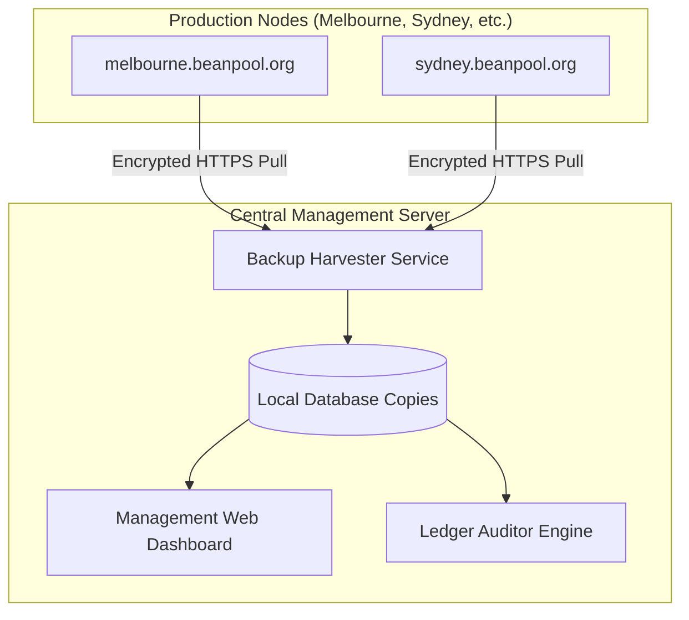

# Multi-Node Management Server Architecture

This document describes the design and topology of the centralized **Multi-Node Management Server** (the "Control Center") used to harvest backups, perform cryptographic audits, and monitor transaction analytics for up to 25+ independent community nodes across Australia.

---

## 1. Component Distribution

By moving to a centralized backup/monitoring architecture, we divide responsibilities between the public community nodes and your private management server.



### What stays on the Production Nodes:
*   **Active Ledger & State:** The live `beanpool.db` (SQLite) accepting writes and managing peer-to-peer trust lines.
*   **Web Portal & PWA Client:** Exposes the marketplace, map pins, and encrypted user messaging interfaces to the general public.
*   **Sync API:** The `/api/local/admin/sync-snapshot` endpoint (gated by `X-Admin-Password`) used by the central server to pull database backups.

### What runs on the Management Server:
*   **Backup Harvester Service:** A lightweight Cron runner that loops through all registered node URLs and downloads their database snapshots.
*   **Local Database Store:** A directory storing the downloaded SQLite databases offline (`/backups/<node-name>/beanpool.db`).
*   **Management Dashboard:** A private, key-restricted, single-page web application showing network-wide analytics.
*   **Audit Engine:** Script that runs local SQL verification queries against the offline database files.

---

## 2. Server Directory Layout

On the management server, the project folder will be structured to keep backup files organized and separated:

```text
/app/beanpool-manager/
├── docker-compose.yml       # Runs the harvester and dashboard UI
├── config.json              # List of active nodes, URLs, and admin credentials
├── backups/                 # Stored SQLite database files
│   ├── melbourne/
│   │   ├── beanpool.db      # Latest active replica
│   │   └── history/         # Daily zipped archives
│   ├── castlemaine/
│   │   └── beanpool.db
│   └── sydney/
│       └── beanpool.db
└── dashboard/               # Frontend code for the private monitoring UI
```

---

## 3. Web Dashboard Layout (The Interface)

Unlike a standard node PWA (which is for active trading, messaging, and map browsing), the **Management Dashboard** is a read-only analytics and control panel. 

### What we REMOVE (Not needed on the manager):
*   ❌ **The Map Interface:** You do not need coordinates or user pins.
*   ❌ **P2P Messaging:** The manager does not participate in chat or hold E2E keys.
*   ❌ **Profile / Wallet Setup:** No seed phrase or callsign creation.

### What we KEEP & ADD (The 4 Core Tabs):

#### Tab 1: Network Overview (The "Health Grid")
A high-level dashboard showing the status of all registered nodes in Australia.
*   **Visual Grid:** List of all nodes (Melbourne, Castlemaine, Sydney, Adelaide, Perth).
*   **Status Indicators:** Online/Offline status, last ping time, and last successful backup sync.
*   **Key Metrics per Node:** Total member count, active offer count, total transactions, and the current Commons Pool balance.

#### Tab 2: Node Detail & Selector (Drilldown)
A dropdown menu allows you to select a specific node (e.g. "Castlemaine") to view its local metrics:
*   **Growth Chart:** Graphs showing member signups and daily transaction volume over time.
*   **Activity Ledger:** A read-only view of the recent transactions (anonymized, showing public keys or callsigns and transfer amounts).
*   **Escrow Monitor:** List of active trades currently locked in escrow.

#### Tab 3: Ledger Auditor (The Audit Console)
This replaces the standard node audit page and runs validation checks on the selected node's offline database:
*   **Conservation Check:** Runs `SELECT SUM(balance)` which **must equal exactly 0**.
*   **Signature Verifier:** Scans the block headers to verify that transaction signatures have not been forged.
*   **Debt Violations:** Lists any callsigns whose balance has crossed below their allowed credit bands (e.g. Newcomer below 0, Resident below -200).

#### Tab 4: Backup Control Panel
Manages the backup schedule and recovery operations:
*   **Manual Pull Trigger:** Buttons to instantly force a backup pull for a specific node.
*   **Restore Runbook:** Clear instructions and copy-paste commands to push a backup file to a new target VM if a node suffers a hardware failure.
