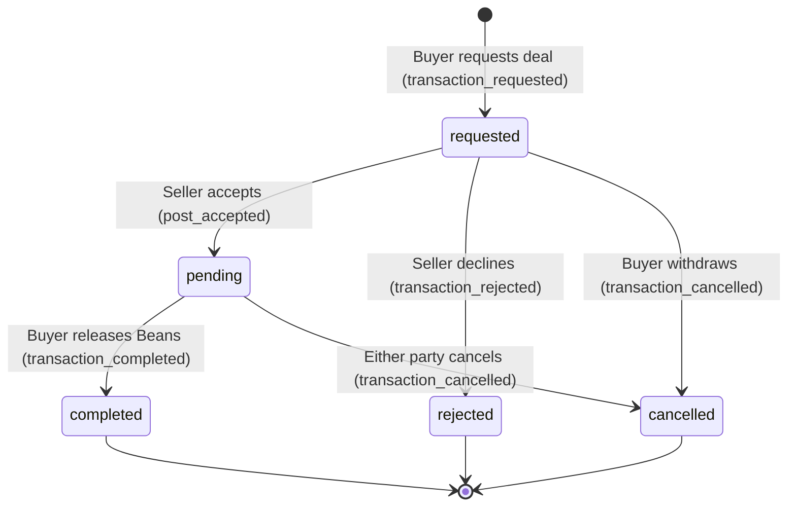

# REALTIME & OFFLINE PARITY AUDIT: NATIVE VS PWA

**Repository**: `beanpool-org/beanpool` (`/Users/marty/projects/bp-audit-3`)  
**Commit**: `origin/main` (Clean Read-Only Audit)  
**Target Clients**: `apps/native` (Lead/Reference) vs `apps/pwa/src` (Web PWA)  
**Backend**: `apps/server/src` (Node.js backend with Fastify/Koa and WebSocket server)  

---

## 1. Executive Summary & Architectural Overview

The BeanPool system operates on a single Node.js backend (`apps/server`) serving two distinct frontends:
1. **`apps/native` (Lead Reference)**: A React Native / Expo application utilizing an embedded SQLite database (`expo-sqlite`) as a local-first source of truth. Incoming WebSocket notifications act as lightweight invalidation doorbells or incremental synchronization triggers (`apps/native/services/ws-client.ts`, `apps/native/services/pillar-sync.ts`).
2. **`apps/pwa` (Web Client)**: A React SPA utilizing ephemeral in-memory state (`useState`), `localStorage` for keys and blocks, and HTTP polling as its primary synchronization strategy (`apps/pwa/src/lib/sync.ts`).

### Core Architectural Disparity
- **Realtime Dispatch**: The server broadcasts 26 distinct event types over `/ws` (`apps/server/src/state-engine.ts:730`). In `apps/native`, 24 of these 26 events trigger an immediate incremental database delta sync (`pillar-sync.ts`) or targeted SQLite upsert. In `apps/pwa`, only **2 pages** (`MessagesPage` and `App.tsx` badge poller) register listeners to `onSyncActivity`. Crucial views such as `MarketplacePage`, `LedgerPage`, `PeoplePage`, and `ProjectsPage` do not subscribe to WebSocket activity events.
- **Reconnection Catch-Up**: When a connection drops and reconnects, `apps/native` proactively initiates `requestSync()` (`apps/native/services/ws-client.ts:123`). In contrast, `apps/pwa` explicitly drops the `state_snapshot` handshake without notifying listeners (`apps/pwa/src/lib/sync.ts:113`), leaving the web client in a stale state until manual page reload or periodic timer ticks.
- **Write Consistency & Latency Races**: On resource-constrained hardware (e.g., 1 vCPU / 1 GB RAM), `apps/native` suffers from two critical race conditions: an unawaited balance refresh in `sendTransfer` leading to stale balance display, and an un-isolated `INSERT INTO posts` colliding with WebSocket delta syncs resulting in `UNIQUE constraint failed: posts.id`.

---

## 2. Area 1 — Realtime Event Parity

The server maintains a global WebSocket feed on `/ws` managed by `addWsClient` and `broadcast` (`apps/server/src/state-engine.ts:705-735`). Under `ENFORCE_WS_AUTH`, events with a `recipients` array are filtered to authenticated sockets matching party public keys (`apps/server/src/state-engine.ts:733`).

### 2.1 Event-by-Event Parity Matrix

| Event Type | Server Emission Site | Native Handled? (`apps/native`) | PWA Handled? (`apps/pwa`) | Parity Disparity & Architectural Mechanism |
| :--- | :--- | :--- | :--- | :--- |
| `state_snapshot` | `apps/server/src/state-engine.ts:710` | **Ignored** (`ws-client.ts:144`) | **Patches State Only** (`sync.ts:101-107`) | Native skips `state_snapshot` to avoid double-sync on connect. PWA stores community counters (`merkleRoot`, `accountCount`) in memory and `localStorage`, but **explicitly suppresses** `activityListeners` (`sync.ts:113`), preventing screens from catching up on reconnect. |
| `state_synced` | `apps/server/src/engine/sync.ts:905` | **Full Delta Sync** (`ws-client.ts:148,153`) | **Poll Nudge Only** (`sync.ts:114`) | Native emits `ws_activity` and runs `requestSync()`, pulling member and post deltas into SQLite. PWA triggers `activityListeners`: `App.tsx:232` polls unread badges; `MessagesPage.tsx:187` polls conversations. Marketplace/Ledger/Projects ignore. |
| `member_joined` | `apps/server/src/engine/members.ts:219`, `state-engine.ts:2934` | **Incremental Sync** (`ws-client.ts:153`) | **Silent Drop** (`PeoplePage.tsx:88-89`) | Native pulls member delta via `pillar-sync.ts:241` into SQLite `members` table and emits `sync_data_updated`. PWA `PeoplePage` only fetches on mount or view switch; newly joined members are invisible until manual reload. |
| `profile_updated` | `apps/server/src/engine/members.ts:197,313`, `state-engine.ts:1751,1770,1790,1811,2817,2822,2850,2868,2879,2992,3118,3795` | **Incremental Sync** (`ws-client.ts:153`) | **Silent Drop** (Non-chat views) | Native syncs member row into SQLite; `PeoplePage`, `ChatsPage`, and profiles update via `sync_data_updated`. PWA does not refresh profile views or member lists; only updates conversation participant cache if `MessagesPage` is active. |
| `user_pruned` | `apps/server/src/state-engine.ts:2993,3119` | **Incremental Sync** (`ws-client.ts:153`) | **Silent Drop** | Native syncs member status change to SQLite. (Tombstone cleanup runs on hourly garbage collection in `db.ts:2012`). PWA ignores; pruned user remains visible in PWA UI until full reload. |
| `treasury_created` | `apps/server/src/state-engine.ts:2935` | **Incremental Sync** (`ws-client.ts:153`) | **Silent Drop** | Native pulls updated member/treasury accounts via `pillar-sync.ts:241`. PWA ignores completely. |
| `new_post` | `apps/server/src/engine/posts.ts:137` | **Incremental Sync** (`ws-client.ts:153`, `pillar-sync.ts:274`) | **Delayed Polling** (`MarketplacePage.tsx:375`) | **High Disparity**: Native pulls post delta into SQLite and re-renders feed within ~200ms. PWA `MarketplacePage` does NOT listen to `onSyncActivity`; relies entirely on a 15-second polling interval (`setInterval(fetchPosts, 15000)`). |
| `post_updated` | `apps/server/src/engine/posts.ts:235,242,251` | **Incremental Sync** (`ws-client.ts:153`, `pillar-sync.ts:274`) | **Delayed Polling** (`MarketplacePage.tsx:375`) | Native updates SQLite post row and emits `sync_data_updated`. PWA feed remains stale for up to 15 seconds. |
| `post_removed` | `apps/server/src/engine/posts.ts:158,274` | **Incremental Sync** (`ws-client.ts:153`, `pillar-sync.ts:274`) | **Delayed Polling** (`MarketplacePage.tsx:375`) | Native marks post inactive in SQLite; excluded by `getPosts()` query. PWA displays deleted post until the next 15s poll tick. |
| `transaction` | `apps/server/src/state-engine.ts:1296` | **Full Delta Sync** (`ws-client.ts:153`, `pillar-sync.ts:316`) | **Delayed Polling** (`LedgerPage.tsx:121`) | Scoped to `[from, to]` under `ENFORCE_WS_AUTH`. Native updates SQLite `transactions` and `accounts`. PWA `LedgerPage` does not listen to `onSyncActivity`; relies on 10-second polling (`setInterval(refresh, 10000)`). |
| `transaction_requested` | `apps/server/src/engine/escrow.ts:136` | **Targeted + Full Sync** (`ws-client.ts:148,153`, `chat/[id].tsx:674`) | **Badge Nudge Only** (`App.tsx:232`) | Native: `chat/[id].tsx` fast-path immediately runs `loadDeals()` (<50ms), and `pillar-sync.ts` updates SQLite. PWA: `App.tsx` updates tab badge count; `MarketplacePage` does not update until 15s poll. |
| `post_accepted` | `apps/server/src/engine/escrow.ts:203,360` | **Targeted + Full Sync** (`ws-client.ts:148,153`, `chat/[id].tsx:674`) | **Refetch if Chat Open** (`MessagesPage.tsx:187`) | Native: In-chat escrow banner transitions instantly to funded/pending. Feed updates via `sync_data_updated`. PWA: In-chat view refetches conversations/txs via HTTP GET; `MarketplacePage` feed remains stale for up to 15s. |
| `transaction_rejected` | `apps/server/src/engine/escrow.ts:248` | **Targeted + Full Sync** (`ws-client.ts:148,153`, `chat/[id].tsx:674`) | **Badge Nudge Only** (`App.tsx:232`) | Native: Chat banner flips to rejected, marketplace status restored in SQLite. PWA: Tab badge updates, but listing card in `MarketplacePage` remains stale until 15s poll. |
| `transaction_cancelled` | `apps/server/src/engine/escrow.ts:281,510` | **Targeted + Full Sync** (`ws-client.ts:148,153`, `chat/[id].tsx:674`) | **Badge Nudge Only** (`App.tsx:232`) | Native: Chat banner flips to cancelled; post unlocked in SQLite. PWA: `MarketplacePage` lags by up to 15s. |
| `transaction_completed` | `apps/server/src/engine/escrow.ts:447` | **Targeted + Full Sync** (`ws-client.ts:148,153`, `chat/[id].tsx:674`) | **Badge Nudge Only** (`App.tsx:232`) | Native: In-chat banner flips to completed; balance/tx synced to SQLite. PWA: Wallet balances on `LedgerPage` lag by up to 10s; marketplace listing lags by up to 15s. |
| `conversation_created` | `apps/server/src/engine/messaging.ts:86` | **Incremental Sync** (`ws-client.ts:153`) | **HTTP Refetch** (`MessagesPage.tsx:187`) | Native runs `pillar-sync.ts:298` pulling conversation row into SQLite. PWA runs `loadConversations()` fetching `/api/conversations?pubkey=...`. |
| `new_message` | `apps/server/src/engine/messaging.ts:180,347` | **Surgical Sync Only** (`ws-client.ts:153`, `chat/[id].tsx:674`) | **Full Conversation Refetch** (`MessagesPage.tsx:224`) | **High Disparity**: Native bypasses `requestSync()` (`ws-client.ts:153`) to prevent sync churn; active chat executes targeted `syncSingleConversation(id)` into SQLite with row-diffing. PWA executes `loadMessages(convId)` which downloads the entire conversation history over HTTP and decrypts every message in JS. |
| `message_reaction` | `apps/server/src/engine/messaging.ts:238` | **Surgical + Full Sync** (`ws-client.ts:148,153`, `chat/[id].tsx:674`) | **Full Conversation Refetch** (`MessagesPage.tsx:224`) | Native patches SQLite message metadata via `upsertFetchedMessage` (`db.ts:2243`). PWA re-downloads and re-decrypts the entire thread history. |
| `message_edited` | `apps/server/src/engine/messaging.ts:286` | **Surgical + Full Sync** (`ws-client.ts:148,153`, `chat/[id].tsx:674`) | **Full Conversation Refetch** (`MessagesPage.tsx:224`) | Native verifies `edited_at` monotonic progression before updating ciphertext in SQLite (`db.ts:2240`). PWA refetches entire thread over HTTP. |
| `system_announcement` | `apps/server/src/state-engine.ts:3137` | **Modal Alert** (`_layout.tsx:702-707`) | **Banner State** (`App.tsx:179-183`) | **Parity Maintained**: Both handle immediately without refetch. Native renders native OS `Alert.alert`. PWA renders top-level dismissible banner (`sysAnnouncement`). |
| `project_created` | `state-engine.ts:3278`, `routes/commons.ts:149` | **Incremental Sync** (`ws-client.ts:153`, `pillar-sync.ts:354`) | **Silent Drop** (`ProjectsPage.tsx:84`) | **High Disparity**: Native syncs project to SQLite; `projects.tsx` refreshes. PWA `ProjectsPage` has **no WS listener and no polling interval** (`useEffect` fetches only on mount). New projects never appear until manual page reload. |
| `project_updated` | `state-engine.ts:3295`, `routes/commons.ts:176,227` | **Incremental Sync** (`ws-client.ts:153`, `pillar-sync.ts:354`) | **Silent Drop** (`ProjectsPage.tsx:84`) | Native updates project in SQLite. PWA silently drops; project edits or pledge progress never update in real time. |
| `project_deleted` | `state-engine.ts:3308`, `routes/commons.ts:195` | **Incremental Sync** (`ws-client.ts:153`, `pillar-sync.ts:354`) | **Silent Drop** (`ProjectsPage.tsx:84`) | Native removes project from SQLite. PWA silently drops; deleted project remains actionable until page reload. |
| `vote_cast` | `apps/server/src/state-engine.ts:3341` | **Incremental Sync** (`ws-client.ts:153`) | **Silent Drop** (`ProjectsPage.tsx:84`) | Native pulls updated project tally into SQLite. PWA silently drops. |
| `voting_round_created`| `apps/server/src/state-engine.ts:3395` | **Incremental Sync** (`ws-client.ts:153`) | **Silent Drop** (`ProjectsPage.tsx:84`) | Native pulls active voting round into SQLite. PWA silently drops. |
| `voting_round_closed` | `apps/server/src/state-engine.ts:3484` | **Incremental Sync** (`ws-client.ts:153`) | **Silent Drop** (`ProjectsPage.tsx:84`) | Native updates winning project and closes round in SQLite. PWA silently drops. |

---

### 2.2 Deal Lifecycle State Machine & UI Transitions

The server orchestrates the marketplace escrow lifecycle across 5 discrete events (`apps/server/src/engine/escrow.ts`):



#### Client Transition Comparison

1. **Buyer Requests Deal (`transaction_requested`)**:
   - **Server**: Inserts `marketplace_transactions` row (`status='requested'`). Broadcasts `transaction_requested` (`escrow.ts:136`).
   - **Native**: 
     - WebSocket doorbell receives event (`ws-client.ts:148`).
     - Emits `ws_activity` -> `chat/[id].tsx:674` triggers immediate `loadDeals()`, which queries SQLite and renders the pending request banner with "Cancel Request" button.
     - Background sync (`pillar-sync.ts:316`) pulls deal row into SQLite.
     - `(tabs)/_layout.tsx:181` triggers `checkUnread(true)` to update tab badges.
   - **PWA**: 
     - `sync.ts:114` triggers `activityListeners`.
     - `App.tsx:232` executes `pollUnread()`, fetching `/api/marketplace/posts` and `/api/marketplace/transactions`. Increments the Marketplace tab badge (`pendingDealsCount`).
     - **Defect**: If the seller is currently viewing `MarketplacePage.tsx`, the listing card does NOT update to show the inbound request until the 15s poll fires (`MarketplacePage.tsx:375`). If viewing `MessagesPage.tsx`, `loadConversations()` updates the transaction card.

2. **Seller Accepts Deal (`post_accepted`)**:
   - **Server**: Atomically locks escrow credits, sets transaction `status='pending'`, sets post `status='pending'`, and executes `injectSystemMessage(ESCROW_FUNDED)` (`escrow.ts:203-212`). Broadcasts `post_accepted` AND `new_message`.
   - **Native**:
     - `chat/[id].tsx:674` fast-path fires on `ws_activity`: runs `syncSingleConversation` + `loadDeals()`. Chat header dynamically swaps from "Accept Request" to "Release Beans" / "Cancel Deal". Injected system message appears in message stream.
     - Feed view (`(tabs)/index.tsx`) receives `sync_data_updated` and marks post "Pending".
   - **PWA**:
     - If chat is open (`MessagesPage.tsx:224`), `loadMessages()` re-downloads all messages and `loadConversations()` re-downloads transactions. The deal banner switches to the active funded state.
     - If on `MarketplacePage.tsx`, the post remains displayed as active/unaccepted for up to 15 seconds.

3. **Settlement / Cancellation (`transaction_completed`, `transaction_cancelled`, `transaction_rejected`)**:
   - **Server**: Adjusts ledger balances, sets transaction terminal status, unlocks or closes post, and injects `ESCROW_RELEASED` or `ESCROW_CANCELLED` (`escrow.ts:447, 510`).
   - **Native**:
     - Chat banner immediately disappears or transitions to completed state.
     - `requestSync()` pulls updated balances and transactions into SQLite.
   - **PWA**:
     - In-chat banner updates via HTTP refetch.
     - **Defect**: On `LedgerPage.tsx`, user's balance does not reflect released or refunded Beans until the 10-second poll fires (`LedgerPage.tsx:121`).

---

### 2.3 Disconnection, Replay & Recovery Mechanisms

#### Server Replay Capabilities
- **Event Replay / Replay Buffer**: **NON-EXISTENT**. The server maintains no message history buffer, event log table, or offset/sequence tracker for WebSocket clients (`apps/server/src/state-engine.ts:705-735`).
- **Connection Upgrade**: `apps/server/src/https-server.ts:1017-1033` verifies authentication signatures under `ENFORCE_WS_AUTH` but accepts no `last_event_id` or resume cursor.
- **Immediate State Snapshot**: On connection, the server sends a single static payload (`apps/server/src/state-engine.ts:709-714`):
  ```json
  {
    "type": "state_snapshot",
    "memberCount": 12,
    "postCount": 45,
    "commonsBalance": 1000
  }
  ```

#### Client Recovery Implementations
1. **Native Catch-Up**:
   - On socket open (`apps/native/services/ws-client.ts:123`):
     ```typescript
     socket.onopen = () => {
         this.reconnectDelay = 1000;
         requestSync(); // Immediate full reconciliation
         ...
     };
     ```
   - `requestSync()` triggers `pillar-sync.ts`:
     - Queries `/api/sync/delta?membersSince=${lastSync}`
     - Queries `/api/marketplace/posts?sync=true&updatedAfter=${lastSync}`
     - Queries `/api/crowdfund/projects`
     - Queries `/api/escrow/deals`
     - Queries `/api/ledger/txns`
   - Replay is handled entirely at the HTTP synchronization layer.
2. **PWA Catch-Up Defect (Silent Reconnect)**:
   - On socket open (`apps/pwa/src/lib/sync.ts:75-76`):
     ```typescript
     currentState = { ...currentState, connected: true };
     notify(); // Only updates internal connection state flag
     ```
   - When server immediately responds with `state_snapshot`, `apps/pwa/src/lib/sync.ts:113` executes:
     ```typescript
     if (data.type !== 'state_snapshot') {
         activityListeners.forEach(cb => cb());
     }
     ```
   - **Result**: `activityListeners` is explicitly bypassed. Reconnecting after any period offline **triggers zero HTTP refetches**. Stale data remains on screen until background poll intervals tick or the user navigates.

---

### 2.4 Surgical Updates vs Full Refetches

| Domain | Native Implementation (`apps/native`) | PWA Implementation (`apps/pwa`) | Overhead & Performance Impact |
| :--- | :--- | :--- | :--- |
| **New Incoming Message** | **Surgical**: Bypasses full sync (`ws-client.ts:153`). `chat/[id].tsx:675` runs `syncSingleConversation(id)`. `diffChangedMessages` (`db.ts:2223`) queries local SQLite and only upserts new/edited rows. | **Heavy Full Refetch**: `MessagesPage.tsx:224` calls `loadMessages(convId)`, making an HTTP GET to `/api/conversations/:id/messages`. Client receives the entire conversation history and decrypts every message via Web Crypto API in JS. | On a 1000-message conversation, PWA performs redundant JSON serialization and cryptographic decryption of 1000 items on every incoming message. Native writes exactly 1 row to SQLite. |
| **Message Reactions / Edits** | **Surgical**: `upsertFetchedMessage` (`db.ts:2243`) updates `metadata` or checks `edited_at` timestamp before updating ciphertext. | **Heavy Full Refetch**: Full conversation download and total thread decryption. | PWA triggers full DOM re-renders and cryptographic churn; Native updates a single SQLite index. |
| **Marketplace Feed** | **Semi-Surgical**: `pillar-sync.ts:274` pulls only posts modified since `lastPostSyncAt`. SQLite executes incremental updates. | **Full Fetch**: `MarketplacePage.tsx:375` re-downloads the entire public post array via `/api/marketplace/posts`. | Network payload scales linearly with community post volume on PWA. |
| **Escrow Status Change** | **Surgical In-Chat**: `chat/[id].tsx:678` re-queries local table `SELECT * FROM marketplace_transactions WHERE post_id=?`. | **Dual Full Fetch**: `MessagesPage.tsx:245` invokes both `loadConversations()` and `loadMessages()`. | PWA issues 2 concurrent HTTP GET requests over the network. |

---

## 3. Area 2 — Offline & Reconciliation Parity

### 3.1 Offline Actions Matrix

| User Action | Native Offline Behavior (`apps/native`) | PWA Offline Behavior (`apps/pwa`) | Queue / Retry Mechanism | Expiry & Dead-Action Risk |
| :--- | :--- | :--- | :--- | :--- |
| **Create Marketplace Post** | **Immediate Rejection** (`db.ts:1483,1557`). Catches network error, throws to UI. SQLite row is NOT written (`db.ts:1561`). User draft preserved in form state. | **Immediate Rejection** (`MarketplacePage.tsx:758`, `api.ts:855`). Fetch fails, throws alert. Draft preserved in modal state. | **None**. Neither client queues offline post creations. | N/A (Action rejected immediately). |
| **Send Chat Message** | **Optimistic Queue & Manual Retry** (`db.ts:2879-2945`). Inserts row into SQLite with `__sendState='sending'`. Network fetch fails -> updates row to `__sendState='failed'`. Bubble displays red exclamation mark. | **Immediate Rejection** (`MessagesPage.tsx:505`). HTTP request fails immediately. Alert displayed. Message text remains in input draft. | **Native**: Manual retry only (`chat/[id].tsx:763`). No automatic background retry. **PWA**: No queue; manual resend by pressing Send again. | If peer deletes account or channel is archived while offline, Native retry fails with server 404/400 and returns to `failed` state. |
| **Accept Deal / Request Escrow** | **Immediate Rejection** (`db.ts:3421,3582`). Network fetch fails; Alert shown. SQLite is not written. | **Immediate Rejection** (`MarketplacePage.tsx:1075`). Fetch fails; alert shown. | **None**. Actions cannot be queued offline. | N/A. |
| **Block User** | **Local Immediate Save + Queued Abuse Report** (`blocklist.ts:74,158`). Public key saved to `AsyncStorage['beanpool_blocked_users']`. Abuse report queued in `AsyncStorage['beanpool_pending_abuse_reports']`. | **Local Immediate Save + Queued Abuse Report** (`blocklist.ts:80,114`). Public key saved to `localStorage['bp_blocked_users']`. Abuse report queued in `localStorage['bp_pending_abuse_reports']`. | **Native**: Flushed on app foreground (`AppState` active, `_layout.tsx:730`). **PWA**: Flushed on window `online` event and app mount (`App.tsx:160-164`). | Queue capped at 50 items. **7-Day TTL**: Expired reports discarded (`Date.now() - timestamp > 7d`). If reported user pruned on server, report permanently errors and remains in queue until TTL expires. |
| **Submit Report (Listing / Profile)** | **Immediate Rejection** (`post/[id].tsx:1599`). Catches network failure; displays Alert. | **Immediate Rejection** (`ReportModal.tsx:74`). Displays error alert. | **None**. Standalone reports are NOT queued (unlike block-initiated reports). | N/A. |
| **Transfer Beans (Ledger)** | **Immediate Rejection** (`db.ts:1320`). Throws network error. | **Immediate Rejection** (`LedgerPage.tsx:136`). Catches error; sets error state. | **None**. Ledger transfers cannot be queued offline. | N/A. |
| **Propose Project (Commons)** | **Immediate Rejection** (`db.ts:1582`). Throws off-grid error. | **Immediate Rejection** (`ProjectsPage.tsx:120`). Fetch fails; displays alert. | **None**. | N/A. |

---

### 3.2 Reconciliation Mechanics After Reconnection

#### 1. Daily Pulse & Deactivated Posts
- **Server Implementation**: When community posts reach threshold or Daily Pulse expires, the server deactivates the placeholder post (`apps/server/src/daily-pulse.ts:138`, `packages/beanpool-engine/src/posts.ts:152`):
  ```sql
  UPDATE posts SET active = 0, status = 'cancelled', updated_at = ? WHERE id = ?
  ```
  *Note*: The server inserts **no tombstone** into the `tombstones` table and emits **no WebSocket broadcast** during Daily Pulse deactivation.
- **Native Reconnection**:
  - Reconnecting triggers `pillar-sync.ts:274`: `GET /api/marketplace/posts?sync=true&updatedAfter=${lastSyncTime}`.
  - Server returns the cancelled post because `sync=true` instructs the server to include inactive posts (`apps/server/src/routes/marketplace.ts:167`).
  - Native `applyDelta` (`db.ts:2210`) updates SQLite: `status='cancelled', active=0`.
  - Native feed query (`db.ts:523`) explicitly filters out cancelled rows (`WHERE status != 'cancelled'`).
  - Client-side feed logic (`apps/native/app/(tabs)/index.tsx:818-825`) also verifies active post count.
  - **Verdict**: Reconciles correctly. Native does not retain stale Daily Pulse placeholders.
- **PWA Reconnection**:
  - PWA maintains no SQLite cache. When `MarketplacePage.tsx` next polls `/api/marketplace/posts`, the server only returns `active=1 AND status='active'`.
  - The Daily Pulse post disappears immediately from the React state array upon the next poll tick.

#### 2. Cross-Device Member Block Reconciliation
- **Server Architecture**: The server contains **no remote blocklist table and no block synchronization endpoint**.
- **Native**: Stores blocked keys in device-local `AsyncStorage['beanpool_blocked_users']` (`apps/native/utils/blocklist.ts:74`).
- **PWA**: Stores blocked keys in browser-local `localStorage['bp_blocked_users']` (`apps/pwa/src/lib/blocklist.ts:80`).
- **Verdict**: **0% Synchronization Parity**. Blocking a user on a mobile device has zero effect on the PWA, and vice versa. Blocked members remain fully visible and able to initiate trades on the alternate client.

#### 3. Deleted Messages & Retracted Data
- **Server Architecture**: The server provides no message deletion or retraction endpoints.
- **Native Stale Message Retention**:
  - In `apps/native/utils/db.ts:2243`, `syncSingleConversation` and `applyDelta` use purely additive upsert logic (`INSERT INTO messages ... ON CONFLICT(id) DO UPDATE SET ...`).
  - If a message row is deleted directly from the backend database (or pruned via server consolidation), Native's SQLite database **never deletes the local row**. Stale/retracted messages survive in Native SQLite indefinitely.
- **PWA Dynamic State**:
  - PWA maintains no local message database. It renders whatever array is returned by `GET /api/conversations/:id/messages`.
  - If a message is deleted on the server, it vanishes from the PWA immediately upon the next fetch.

---

### 3.3 Read-After-Write Ordering & Latency Races (1 CPU / 1 GB Node)

On a resource-constrained node running SQLite with single-threaded event loops, write-to-read latency introduces race conditions:

#### Trace 1: Native Ledger Transfer Stale Balance Display (RACE CONDITION)
1. User submits Bean transfer in `apps/native/app/(tabs)/ledger.tsx:365`.
2. `sendTransfer` (`apps/native/utils/db.ts:1320`) posts to `/api/ledger/transfer`.
3. Server executes transfer and returns `{ success: true, transaction: { ... } }`.
4. `sendTransfer` inserts transaction into local SQLite table `transactions` (`db.ts:1333`).
5. `sendTransfer` initiates balance refresh:
   ```typescript
   // apps/native/utils/db.ts:1340-1341
   refreshBalanceFromServer(from).catch(() => null); // UN-AWAITED FLOATING PROMISE
   refreshBalanceFromServer(to).catch(() => null);
   ```
6. `sendTransfer` returns execution to `ledger.tsx:369`.
7. `ledger.tsx:369` immediately invokes `loadData()`.
8. `loadData()` queries SQLite table `accounts` (`SELECT * FROM accounts WHERE public_key = ?`).
9. **The Race**: On a 1 vCPU node under load, `refreshBalanceFromServer` has not yet completed its HTTP request or written to SQLite. `loadData()` reads the **pre-transfer stale balance**.
10. **UI Symptom**: User sends 50 Beans. Transfer succeeds with haptic feedback. The balance displayed at the top of the wallet remains unchanged until seconds later when the background promise finishes.
11. **PWA Comparison**: PWA avoids this race in `LedgerPage.tsx:141` by explicitly awaiting `await refresh()` (which directly fetches fresh balance over HTTP) before terminating `handleSend()`.

#### Trace 2: Native Post Creation Crash via WebSocket Delta Collision (CRASH DEFECT)
1. User creates a post via `createPost` (`apps/native/utils/db.ts:1473`).
2. Post payload sent to server via HTTP POST `/api/marketplace/posts`.
3. Server commits post and immediately calls `broadcast({ type: 'new_post', post })` (`apps/server/src/engine/posts.ts:137`).
4. WebSocket client on the author's device receives `new_post` (`apps/native/services/ws-client.ts:142`).
5. `ws-client.ts:153` executes `requestSync()`, which triggers `pillar-sync.ts:274`.
6. Background sync fetches `/api/marketplace/posts?sync=true` and executes `applyDelta` (`db.ts:2210`), which inserts the new post into SQLite.
7. Meanwhile, HTTP response from step 2 resolves in `createPost`.
8. `createPost` attempts to save the post locally (`apps/native/utils/db.ts:1562`):
   ```typescript
   await database.runAsync(
       `INSERT INTO posts (id, type, category, title, ...) VALUES (?, ?, ?, ?, ...)`,
       [...]
   );
   ```
9. **The Race**: Because this statement is a bare `INSERT INTO` (not `INSERT OR REPLACE`), if step 6 completes before step 8, SQLite throws:
   ```
   UNIQUE constraint failed: posts.id
   ```
10. **UI Symptom**: `createPost` catches the error and throws it to the UI (`db.ts:1557`). The user receives a false error alert ("UNIQUE constraint failed: posts.id"), believing post creation failed, even though it succeeded on the server and is already stored in local SQLite.

---

## 4. HIGH Priority Findings

### HIGH-01: Native False Post Failure on Fast WebSocket Re-Sync
- **File & Line**: `apps/native/utils/db.ts:1562-1569` vs `apps/native/services/ws-client.ts:153`
- **Severity**: **HIGH** (Action-Loss / Erroneous User Alert)
- **Mechanism**: `createPost` executes bare `INSERT INTO posts` after HTTP confirmation. If the server's WebSocket `new_post` broadcast triggers `pillar-sync.ts` and applies the delta before `createPost`'s local insert executes, SQLite aborts with `UNIQUE constraint failed: posts.id`.
- **Impact**: Users are told their post failed to publish, prompting duplicate submissions or confusion, despite successful database commitment.
- **Remediation**: Change `INSERT INTO posts` to `INSERT OR REPLACE INTO posts` or `INSERT ... ON CONFLICT(id) DO NOTHING` in `db.ts:1563`.

### HIGH-02: Native Stale Balance Render Following Outbound Transfer
- **File & Line**: `apps/native/utils/db.ts:1340-1345` vs `apps/native/app/(tabs)/ledger.tsx:365-369`
- **Severity**: **HIGH** (Data Display / Read-After-Write Desync)
- **Mechanism**: `sendTransfer` executes `refreshBalanceFromServer` as an unawaited floating promise. `ledger.tsx` immediately calls `loadData()` upon `sendTransfer` resolution, querying the un-updated local SQLite `accounts` table.
- **Impact**: On resource-constrained nodes, senders observe their balance failing to deduct immediately after a transfer confirmation.
- **Remediation**: `await refreshBalanceFromServer(from)` prior to returning from `sendTransfer`.

### HIGH-03: PWA WebSocket Silent Reconnection Leaves Views Indefinitely Stale
- **File & Line**: `apps/pwa/src/lib/sync.ts:75,113-115`
- **Severity**: **HIGH** (Hidden Events / Stale UI)
- **Mechanism**: On WebSocket reconnection, `apps/pwa` receives `state_snapshot` from the server. `sync.ts:113` explicitly suppresses `activityListeners` when `data.type === 'state_snapshot'`. Furthermore, `socket.onopen` does not trigger any HTTP reconciliation.
- **Impact**: When a PWA reconnects after sleep or connection drop, no queries are issued. Deals accepted, payments received, or posts created during the disconnect are completely invisible until periodic polling ticks (up to 15s) or manual page refresh.
- **Remediation**: Invoke `activityListeners.forEach(cb => cb())` inside `socket.onopen` in `apps/pwa/src/lib/sync.ts:76`.

### HIGH-04: PWA Silent Drop of All Governance & Commons Activity
- **File & Line**: `apps/pwa/src/pages/ProjectsPage.tsx:84-86` vs `apps/server/src/routes/commons.ts:149,176,195`
- **Severity**: **HIGH** (Lost Realtime Updates / Governance Desync)
- **Mechanism**: The server broadcasts `project_created`, `project_updated`, `project_deleted`, `vote_cast`, `voting_round_created`, and `voting_round_closed`. `apps/pwa/src/pages/ProjectsPage.tsx` mounts with a single `useEffect` fetch and contains **neither an `onSyncActivity` subscription nor a polling interval**.
- **Impact**: Members viewing the Commons tab on PWA never see new crowdfund projects, pledge totals, or voting round outcomes in real time. The page remains frozen in its initial mount state.
- **Remediation**: Subscribe `ProjectsPage.tsx` to `onSyncActivity` and attach a 15s polling fallback.

### HIGH-05: PWA Marketplace & Ledger Inactive WebSocket Integration
- **File & Line**: `apps/pwa/src/pages/MarketplacePage.tsx:375`, `apps/pwa/src/pages/LedgerPage.tsx:121`
- **Severity**: **HIGH** (Realtime Latency Disparity)
- **Mechanism**: While `apps/native` reflects marketplace and ledger changes within <200ms via `ws_activity` and SQLite sync, `MarketplacePage.tsx` and `LedgerPage.tsx` ignore WebSocket doorbells entirely, relying solely on 15s and 10s intervals.
- **Impact**: Deals accepted or cancelled by counter-parties do not update the marketplace card or wallet balance in real time, causing users to interact with stale listings.
- **Remediation**: Register `onSyncActivity` listeners inside `MarketplacePage.tsx` and `LedgerPage.tsx`.

### HIGH-06: Total Lack of Cross-Device Blocklist Synchronization
- **File & Line**: `apps/native/utils/blocklist.ts:74` vs `apps/pwa/src/lib/blocklist.ts:80`
- **Severity**: **HIGH** (Safety & Privacy Failure)
- **Mechanism**: Neither client syncs blocked public keys to the server; blocklists reside exclusively in `AsyncStorage` (native) and `localStorage` (PWA).
- **Impact**: A member blocked on a phone remains unblocked on the web client. The blocked user can message or initiate transactions with the member on PWA.
- **Remediation**: Introduce an encrypted or signed server-side blocklist storage endpoint.

---

## 5. Limitations & Out-of-Scope Items

1. **OS Background Process Termination**: Exact behavior when mobile OS (iOS APNs / Android Battery Optimization) suspends `apps/native` in the background could not be tested via static code audit. Native background catches rely on Push Notifications (`apps/server/src/push.ts`), whereas PWA background sync depends on Web Push / ServiceWorker behavior.
2. **ClickHouse Log Engine Latency**: On nodes running ClickHouse logs concurrently with SQLite on 1 CPU / 1 GB RAM, I/O saturation may alter HTTP response times under load; synthetic benchmark latency measurements were outside this read-only audit.
3. **Multi-Node Federated Sync**: The audit was scoped to the interaction between a single anchor node and its two client frontends; inter-node gossip convergence delays (`apps/server/src/federation-protocol.ts`) were not evaluated.
