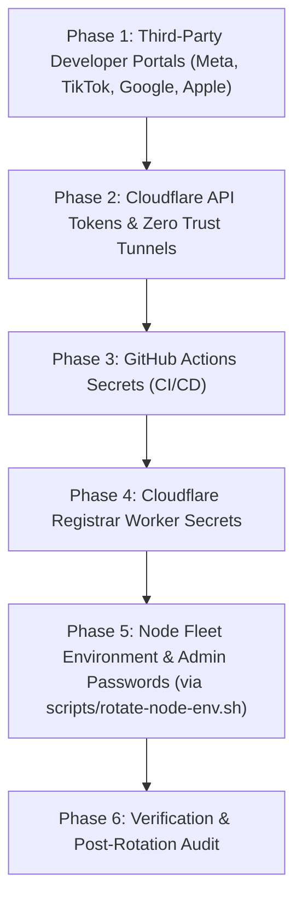

# BeanPool Secrets Rotation Runbook & Tooling

> **Target Audience:** Maintainer (Martin) and Fleet Operators  
> **Status:** Operational Runbook & Tooling Manual for Pre-Launch Secrets Sweep  
> **Scope:** Complete sweep and rotation of all secrets across third-party platforms, Cloudflare infrastructure, GitHub Actions, node fleet `.env` files, and local developer configs.

---

## 1. Incident Context & Rationale

Before BeanPool is publicly launched and opened to the public, all credentials, API tokens, administrative passwords, and service secrets must be rotated in a single coordinated sweep.

Two recorded security exposure events make this mandatory:
1. **2026-09-03 (Meta / Instagram App Secret):** The Meta/Instagram application secret used for The Pulse creator channel integration was partially exposed during development.
2. **2026-09-15 (Test VM Environment Echo):** Environment variable values from `/root/BeanPool-Test/.env` on `ssh-qld.beanpool.org` were echoed into a development session transcript.

Because production deployment configurations (`deploy.sh`) shared Cloudflare credentials, admin passwords, and tunnel tokens across nodes, **every secret present in those `.env` files, repository configs, and third-party dashboards is treated as potentially known and must be replaced.**

---

## 2. Comprehensive Secrets Inventory

This inventory enumerates every secret the BeanPool system uses across all layers.  
*(Note: Code and config references only; secret values are never committed or printed).*

| Secret Name / Identifier | Where It Lives | Purpose & Scope | Exposure / Source |
| :--- | :--- | :--- | :--- |
| **`INSTAGRAM_APP_SECRET`** (or `INSTAGRAM_CLIENT_SECRET`) | Node `/root/BeanPool-<Name>/.env`<br>`docker-compose.yml` | Meta/Instagram OAuth code-for-token exchange for The Pulse creator syndication (`apps/server/src/routes/channels.ts`). | Partially exposed 2026-09-03 |
| **`INSTAGRAM_APP_ID`** | Node `.env`<br>`docker-compose.yml`<br>`apps/server/src/routes/channels.ts` | Meta Application ID for The Pulse. Associated with the app secret above. | Paired with exposed secret |
| **`TIKTOK_CLIENT_SECRET`** | Node `.env`<br>`docker-compose.yml`<br>`apps/server/src/routes/channels.ts` | TikTok Open API client secret for The Pulse OAuth token relay. | In test VM `.env` |
| **`TIKTOK_CLIENT_KEY`** (or `TIKTOK_CLIENT_ID`) | Node `.env`<br>`docker-compose.yml`<br>`apps/server/src/routes/channels.ts` | TikTok Open API client key. | In test VM `.env` |
| **`ADMIN_PASSWORD`** | Node `/root/BeanPool-<Name>/.env`<br>Repo root `.env`<br>`deploy.sh`<br>`data/local-config.json` (scrypt hash) | Per-node root administrative password for `/api/local/admin/*`, backup pulls, and React manager login. | Echoed in 2026-09-15 transcript |
| **`BACKUP_ADMIN_PASSWORD`** | Backup node `.env` (`test-mirror` / replicas) | Secondary node password to fetch snapshots from primary's `/api/local/admin/sync-snapshot`. | Echoed in 2026-09-15 transcript |
| **`CF_API_TOKEN` (Node / Repo)** | Repo root `.env`<br>Node `.env`<br>`deploy.sh` | Cloudflare API token with Zone DNS edit permissions used for dynamic record updates. | Echoed in 2026-09-15 transcript |
| **`CF_API_TOKEN` (Registrar)** | Cloudflare Worker secret (`wrangler secret put`) | Scoped Cloudflare API token with `Account·Cloudflare Tunnel·Edit` and `Zone·DNS·Edit` permissions. | Cloudflare Worker runtime |
| **`CF_TUNNEL_TOKEN`** | Repo root `.env`<br>`deploy.sh`<br>Node `<node>/data/tunnel-token` | Cloudflare Zero Trust tunnel connector token for `cloudflared` sidecar container. | Echoed in 2026-09-15 transcript |
| **`ADMIN_SECRET` (Registrar)** | Cloudflare Worker secret<br>`apps/website/admin.html` | Shared secret for registrar Worker administrative endpoints (`/api/local/admin/registrar/*`). | Cloudflare Worker runtime |
| **`CLOUDFLARE_API_TOKEN`** | GitHub Actions Secret | Used in `.github/workflows/deploy-website.yml` to deploy `apps/website` to Cloudflare Pages. | GitHub Repo Secrets |
| **`CLOUDFLARE_API_KEY`** | GitHub Actions Secret<br>Repo root `.env` | Global Cloudflare API Key (fallback credentials for legacy wrangler operations). | GitHub Repo Secrets |
| **`CLOUDFLARE_EMAIL`** | GitHub Actions Secret<br>Repo root `.env` | Cloudflare account email associated with `CLOUDFLARE_API_KEY`. | GitHub Repo Secrets |
| **`CLOUDFLARE_ACCOUNT_ID`** | GitHub Actions Secret<br>`apps/registrar/wrangler.toml` | Cloudflare Account ID (`151a28c4fd1e6ee09768f4226be76b4d`). | Public / semi-private identifier |
| **`CF_ZONE_ID`** | Repo `.env`, Node `.env`, `wrangler.toml` | Cloudflare Zone ID for `beanpool.org` (`060a99ae34e53b26dcf3be6578722b31`). | Public / semi-private identifier |
| **`BACKUP_REPLICATION_TOKEN`** | Shell env / shadow backup compose | Authentication token for shadow replica snapshot pulls (`docker-compose.shadow-backup.yml`). | Validation test rig |
| **`GOOGLE_MAPS_API_KEY`** | `apps/native/eas.json` (build profile) | Android Google Maps API key restricted to package `org.beanpool.pillar`. | Client bundle / EAS build |
| **`pc-api-key.json`** | Local maintainer machine<br>`apps/native/eas.json` | Google Play Console API service account private key for automated app submission. | Google Cloud service account |
| **`google-services.json` / FCM Key** | Local maintainer machine<br>`apps/native/` | Firebase Cloud Messaging configuration and server credentials (`beanpool-6196d`). | Firebase Console |
| **Apple Developer Signing Key (`*.p8`)** | Local maintainer machine | Apple Sign In & Universal Links private key (Team `485XM2R33S`, bundle `org.beanpool.pillar`). | Apple Developer portal |
| **EAS Keystore / Credentials** | Expo Application Services cloud | Android release signing keystore and iOS distribution certificates. | Expo EAS project |
| **SSH Host Keys** | Maintainer `~/.ssh/` (`id_rsa` / `id_ed25519` / `id_azure_lattice`) | SSH root access to VM hosts `ssh-vic.beanpool.org` and `ssh-qld.beanpool.org`. | Host authentication |
| **Node `community.key`** | `/root/BeanPool-<Name>/data/community.key` | Ed25519 private key defining the cryptographic identity of the node community. | Node-local persistence |

---

## 3. Order of Operations & Rotation Runbook

Rotating secrets must follow an explicit dependency order. Rotating a consumer before a provider produces immediate outages (e.g. rotating Cloudflare tokens before updating the registrar or `cloudflared` causes HTTP 530 / Error 1033 tunnel disconnects).

### Dependency Sequence Overview



---

### Phase 1: Third-Party Developer Portals

#### 1.1 Meta for Developers (Instagram App Secret & App ID)
*   **Context:** Exposed on 2026-09-03. Remember: The member SSO app (`818892721251369`) is distinct from the Pulse Creator app.
*   **Where to generate:**
    1. Log in to [developers.facebook.com](https://developers.facebook.com/).
    2. Select the Pulse creator application (e.g. `BeanPool Pulse`).
    3. Navigate to **App settings** $\to$ **Basic**.
    4. Next to **App secret**, click **Reset**.
    5. *(If recreating the app completely)* Note the new **App ID** and **App Secret**.
*   **Places to update:**
    - Each node's `/root/BeanPool-<Name>/.env`: `INSTAGRAM_APP_ID` and `INSTAGRAM_APP_SECRET`.
*   **How to update:**
    Use `scripts/rotate-node-env.sh`:
    ```bash
    bash scripts/rotate-node-env.sh --nodes test,review INSTAGRAM_APP_ID="<new_id>" INSTAGRAM_APP_SECRET="<new_secret>"
    ```
*   **How to verify:**
    ```bash
    curl -s https://test.beanpool.org/api/pulse/oauth/config | grep -q '"instagram":{"enabled":true' && echo "OK"
    ```

#### 1.2 TikTok Open API (Client Key & Secret)
*   **Where to generate:**
    1. Log in to [developers.tiktok.com](https://developers.tiktok.com/).
    2. Navigate to **Manage apps** $\to$ `BeanPool Pulse` $\to$ **App Details**.
    3. Under **Client Secret**, click **Reset**.
*   **Places to update:**
    - Each node's `/root/BeanPool-<Name>/.env`: `TIKTOK_CLIENT_KEY` and `TIKTOK_CLIENT_SECRET`.
*   **How to update:**
    ```bash
    bash scripts/rotate-node-env.sh --nodes test,review TIKTOK_CLIENT_KEY="<new_key>" TIKTOK_CLIENT_SECRET="<new_secret>"
    ```
*   **How to verify:**
    ```bash
    curl -s https://test.beanpool.org/api/pulse/oauth/config | grep -q '"tiktok":{"enabled":true' && echo "OK"
    ```

#### 1.3 Google Cloud Platform (Maps API Key & Play Service Account)
*   **Where to generate:**
    1. In [Google Cloud Console](https://console.cloud.google.com/), select the BeanPool project.
    2. **Maps API Key:** Go to **APIs & Services** $\to$ **Credentials**. Create or regenerate API key restricted to package `org.beanpool.pillar` and SHA-256 fingerprint.
    3. **Play Service Account:** Go to **IAM & Admin** $\to$ **Service Accounts**, select the Google Play publish service account, navigate to **Keys** $\to$ **Add Key** $\to$ **Create new key** (JSON).
*   **Places to update:**
    - `apps/native/eas.json`: Update `GOOGLE_MAPS_API_KEY` under build profiles.
    - Local workstation: Replace `./pc-api-key.json` for EAS submit.
*   **How to verify:**
    Run native TypeScript checks:
    ```bash
    pnpm --filter native exec expo config --type public
    ```

---

### Phase 2: Cloudflare API Tokens & Tunnels

#### 2.1 Cloudflare Scoped DNS & Tunnel API Tokens
*   **Where to generate:**
    1. In Cloudflare Dashboard $\to$ **My Profile** $\to$ **API Tokens** $\to$ **Create Token**.
    2. Create Token A (Node DNS updater):
       - Permissions: `Zone` $\to$ `DNS` $\to$ `Edit`
       - Zone Resources: `Include` $\to$ `Specific zone` $\to$ `beanpool.org`
    3. Create Token B (Registrar Worker):
       - Permissions:
         - `Account` $\to$ `Cloudflare Tunnel` $\to$ `Edit`
         - `Zone` $\to$ `DNS` $\to$ `Edit`
       - Account Resources: `Include` $\to$ `Account` $\to$ `151a28c4fd1e6ee09768f4226be76b4d`
       - Zone Resources: `Include` $\to$ `Specific zone` $\to$ `beanpool.org`
    4. Create Token C (Pages Deploy / CI):
       - Permissions: `Account` $\to$ `Cloudflare Pages` $\to$ `Edit`
*   **Places to update:**
    - Token A: Local repo `.env` (`CF_API_TOKEN`) and node fleet `.env`.
    - Token B: Registrar Worker secret (`wrangler secret put CF_API_TOKEN`).
    - Token C: GitHub Actions Secret (`CLOUDFLARE_API_TOKEN`).

#### 2.2 Cloudflare Zero Trust Tunnel Tokens
*   **Where to generate:**
    1. In Cloudflare Zero Trust $\to$ **Networks** $\to$ **Tunnels**.
    2. Locate existing tunnels (`qld`, `vic`, per-node tunnels).
    3. If rotating tunnel credentials: click **Configure**, rotate the connector token, or provision replacement tunnel connectors.
*   **Places to update:**
    - On target node: write token directly to `/root/BeanPool-<Name>/data/tunnel-token` with permissions `chmod 600`.
    - Note: Only `test` and `yarravalley` currently run `cloudflared` container sidecars.
*   **How to verify:**
    ```bash
    docker logs beanpool-test-cloudflared-1 --tail 20
    # Must show: "Connection established" / "Registered tunnel connection"
    # Never: "Unauthorized: Tunnel not found" or HTTP 530 / Error 1033
    ```

---

### Phase 3: GitHub Actions Secrets

*   **Where to update:**
    1. In GitHub repository: **Settings** $\to$ **Secrets and variables** $\to$ **Actions**.
    2. Update Repository Secrets:
       - `CLOUDFLARE_API_TOKEN`: Paste Token C from Step 2.1.
       - `CLOUDFLARE_API_KEY`: Update Global API Key if rotated.
       - `CLOUDFLARE_EMAIL`: Maintainer account email.
       - `CLOUDFLARE_ACCOUNT_ID`: `151a28c4fd1e6ee09768f4226be76b4d`.
*   **How to verify:**
    Trigger workflow dispatch on `.github/workflows/deploy-website.yml`:
    ```bash
    gh workflow run deploy-website.yml
    gh run watch
    ```

---

### Phase 4: Cloudflare Registrar Worker Secrets

*   **Where to update:**
    From `apps/registrar/`:
    ```bash
    cd apps/registrar
    npx wrangler secret put CF_API_TOKEN     # Paste Token B from Step 2.1
    npx wrangler secret put ADMIN_SECRET     # Generate with openssl rand -hex 24
    npx wrangler secret put CF_ACCOUNT_ID    # 151a28c4fd1e6ee09768f4226be76b4d
    npx wrangler secret put CF_ZONE_ID       # 060a99ae34e53b26dcf3be6578722b31
    npx wrangler deploy
    ```
*   **How to verify:**
    ```bash
    curl -s -H "x-admin-secret: <new_admin_secret>" https://beanpool.org/api/local/admin/registrar/allocations | head -c 100
    ```

---

### Phase 5: Node Fleet Environment & Admin Passwords

#### ⚠️ Critical Gotcha: `local-config.json` Admin Lock
When `ADMIN_PASSWORD` is initialized on first boot, the server creates an scrypt hash in `/root/BeanPool-<Name>/data/local-config.json` and sets `"isLocked": true`.  
**Subsequent changes to `ADMIN_PASSWORD` in `.env` are IGNORED by the server while `isLocked` is true.**

To rotate `ADMIN_PASSWORD` on an existing node:
1. Generate new strong password: `NEW_PW=$(openssl rand -base64 24)`
2. Update `.env` using `scripts/rotate-node-env.sh`:
   ```bash
   bash scripts/rotate-node-env.sh --nodes test ADMIN_PASSWORD="$NEW_PW" CF_API_TOKEN="<new_cf_token>"
   ```
3. Reset the password lock in `local-config.json` on the node:
   ```bash
   ssh root@ssh-qld.beanpool.org "node -e '
     const fs = require(\"fs\");
     const p = \"/root/BeanPool-Test/data/local-config.json\";
     if (fs.existsSync(p)) {
       const cfg = JSON.parse(fs.readFileSync(p, \"utf8\"));
       cfg.isLocked = false;
       delete cfg.adminHash;
       delete cfg.salt;
       fs.writeFileSync(p, JSON.stringify(cfg, null, 2));
       console.log(\"Lock cleared\");
     }
   '"
   ```
4. Restart the node container so `initAdminPassword` re-hashes and re-locks with the new password:
   ```bash
   ssh root@ssh-qld.beanpool.org "cd /root/BeanPool-Test && docker compose -p beanpool-test up -d --no-deps --force-recreate beanpool-node"
   ```
5. On any backup node replicate: update `BACKUP_ADMIN_PASSWORD` to match the primary's new `ADMIN_PASSWORD`.

---

## 4. Verification Checklist & Health Checks

Run these commands after completing the rotation sweep:

| Target | Verification Command | Expected Outcome |
| :--- | :--- | :--- |
| **Node API Status** | `curl -sk https://test.beanpool.org/api/version` | HTTP 200 with `{ "version": ... }` |
| **Pulse Config** | `curl -sk https://test.beanpool.org/api/pulse/oauth/config` | HTTP 200 with enabled providers and valid client keys |
| **Admin Authentication** | `curl -sk -H "x-admin-password: $NEW_PW" https://test.beanpool.org/api/local/admin/status` | HTTP 200 with node status payload (HTTP 401 with bad password) |
| **Backup Pull Convergence** | `ssh root@ssh-qld.beanpool.org "docker logs --tail 30 beanpool-test-mirror-beanpool-node-1"` | `[Backup] ⬇️ Pulled snapshot` (no 401 Unauthorized) |
| **Cloudflare Tunnel Status** | `ssh root@ssh-qld.beanpool.org "docker logs --tail 20 beanpool-test-cloudflared-1"` | `Registered tunnel connection` / 0 errors |
| **Registrar Attestation** | `curl -sk -H "x-admin-secret: $NEW_ADMIN_SECRET" https://beanpool.org/api/local/admin/registrar/allocations` | HTTP 200 list of allocations |
| **CI Secrets Guard** | `bash scripts/test-all.sh` | Secrets guard check passes with 0 leaks |

---

## 5. What the Maintainer Must Do By Hand

Because third-party administrative accounts and multi-factor authentication (2FA) tokens reside exclusively with Martin, the following steps **must be performed by hand**:

1. **Meta for Developers:**
   - Log into [developers.facebook.com](https://developers.facebook.com/) with the account holding the Meta Business Portfolio.
   - Reset the App Secret for the Pulse creator app.
   - Note: Do NOT touch or submit member SSO App `818892721251369` for review.
2. **TikTok for Developers:**
   - Log into [developers.tiktok.com](https://developers.tiktok.com/).
   - Reset the Client Secret under App Details.
3. **Cloudflare Dashboard:**
   - Create the 3 scoped tokens under Profile $\to$ API Tokens (DNS Edit, Worker Tunnel+DNS Edit, Pages Deploy).
   - Verify tunnel tokens under Zero Trust $\to$ Networks $\to$ Tunnels.
4. **Google Cloud Console:**
   - Regenerate `GOOGLE_MAPS_API_KEY` under APIs & Services $\to$ Credentials.
   - Download fresh `pc-api-key.json` if service account keys are rotated.
5. **Apple Developer Portal:**
   - Verify Apple Services ID `org.beanpool.web` and ensure Team ID `485XM2R33S` is valid.
6. **Deploy Worker & Fleet:**
   - Run `npx wrangler secret put` in `apps/registrar/`.
   - Run `bash scripts/rotate-node-env.sh` with the gathered new credentials.
   - Clear `local-config.json` admin lock on each target node to activate the new `ADMIN_PASSWORD`.
