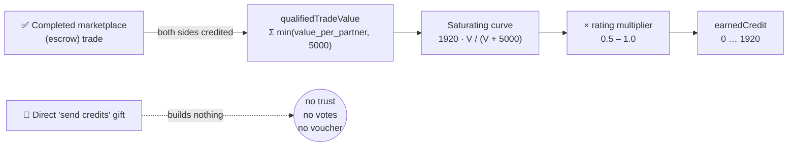
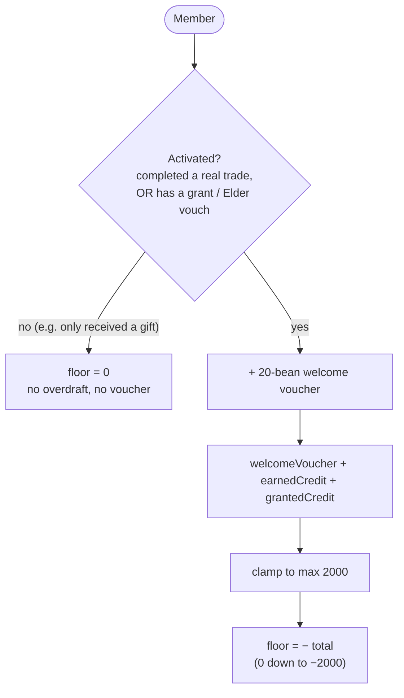
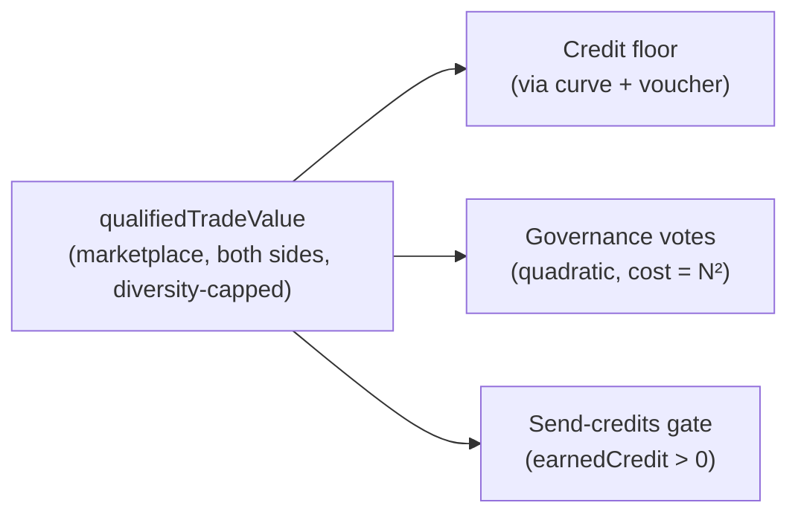
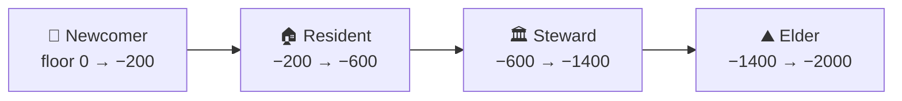
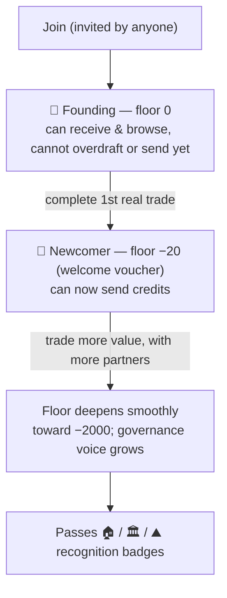

# Trust Model v2 — Shipped Reference

> **Status: LIVE on `main`** (PR #1–#9, 2026-07). This is the canonical description of the
> *implemented* trust/credit system. The design rationale and the not-yet-built roadmap live in
> [`trust-model-v2.md`](./trust-model-v2.md); this document is the "what actually runs" reference.

---

## 0. The one idea

**A floor doesn't create beans from thin air — it authorises a matched IOU.** Credit is sized to
the probability it will be honoured, and fake identity is made expensive. Every mechanism below
serves those two goals. **Credit is not inflation; default is.**

The whole model now keys off **one signal** — `qualifiedTradeValue`: the value you've cycled
through **completed marketplace (escrow) trades**, attributed to the real counterparty, capped per
counterparty, and credited to **both** sides. Direct "send credits" gifts are *helping a friend* —
they build nothing. Trust, your credit floor, and your governance voice all derive from this one
number, so you can't buy any of them with something you couldn't also turn into trust.

---

## 1. Canonical formulas

```
qualifiedTradeValue(m)  = Σ over each real counterparty cp of  min( Σ completed-trade-credits(m,cp), 5000 )
earnedCredit(m)         = floor( 1920 · V / (V + 5000) ) · ratingMultiplier      where V = qualifiedTradeValue(m)
ratingMultiplier        = reviews>0 ? 0.5 + 0.5·(avgStars/5) : 1.0               (range 0.5–1.0)

activated(m)            = qualifiedTradeValue > 0  OR  grantedCredit > 0  OR  elderVouched
welcomeVoucher(m)       = activated ? 20 : 0

floor(m)                = − min( 2000, welcomeVoucher + earnedCredit + grantedCredit )      (0 … −2000)

governanceCredits(m)    = qualifiedTradeValue(m)                                 (quadratic voting: N votes cost N²)
canSendCredits(m)       = earnedCredit > 0                                       (i.e. ≥1 completed trade of real value)
```

Constants (`packages/beanpool-core/src/protocol.ts`): `CREDIT_BASE_FLOOR = 0`,
`NEWCOMER_VOUCHER = 20`, `CREDIT_FLOOR_CAP = 2000`, `CREDIT_MAX_EARNED = 1920` (curve asymptote),
`TRUST_CURVE_K = 5000`, `PER_COUNTERPARTY_VOLUME_CAP = 5000`.

---

## 2. What builds trust (and what doesn't)



- **Value is the lever, not handshakes.** A 3-bean trade earns ~1; a 5 000-bean trade ~960. The old
  "3-bean unlocks a floor" cliff is gone.
- **Diversity beats repetition.** Value with any *one* partner caps at 5 000, so trading widely
  climbs far faster than repeat trades with a single partner — and it can't be farmed with socks.
- **Saturating**, so no single account runs away toward the cap.

---

## 3. How your credit floor is computed



The floor **slides continuously** — there are no fixed per-tier steps. The `−20` a newcomer sees is
just the welcome voucher; from there it deepens smoothly with traded value, down to the `−2000` cap.
The activation gate is what stops a Sybil from gifting 1 bean to N sock accounts to mint N × −20
floors — you must complete a *real* trade first.

---

## 4. One signal, three uses



Before this rebase these ran on three *different* bases (count-based trust, outbound-transfer
volume for votes, a tier label for sending) — each a separate Sybil surface. Now they share one
hardened signal.

---

## 5. Tiers (recognition milestones)

Tiers are **cosmetic badges** mapped from your floor depth — they do **not** set your credit line
(that's continuous). `getTier(floor)`:



| Tier | Floor range | Credit needed (earned+granted) |
|------|-------------|-------------------------------|
| 🌱 Newcomer | `0 … −200` | 0 |
| 🏠 Resident | `−200 … −600` | 180 |
| 🏛️ Steward | `−600 … −1400` | 580 |
| ⛰️ Elder | `−1400 … −2000` | 1380 |

**Open to everyone, no tier required:** inviting new members, a trade-weighted governance voice, and
no daily spending limits. The only tier-linked reward is a deeper credit floor; Elder adds
recognition. Admin *genesis* invites pre-seed grants of 180 / 580 / 1380 to place a member at the
Resident / Steward / Elder floor.

---

## 6. A member's journey



---

## 7. Threat model → shipped mitigations

| Threat | Mitigation now live | PR |
|--------|---------------------|----|
| **Partner farm** — 1 bean to N socks, each partner +40 credit | Trust is a saturating curve on *value*; no per-partner bonus | #1 |
| **Wash-trading** one partner to inflate | Per-counterparty cap (5 000) on value | #1 / #3 |
| **Gifts building trust** | Trust counts *completed marketplace trades only*; gifts build nothing | #3 |
| **Gift-bought votes** | Governance credit = `qualifiedTradeValue` (was outbound-transfer volume) | #6 |
| **Gift-minted overdraft** (voucher faucet) | Voucher/overdraft activates only on a completed marketplace trade | #9 |
| **Rating-bomb sabotage** | Ratings gated to real trade counterparties (one per completed trade) | pre-existing, verified |
| **Baked-in "thin-air" credit** | Base floor 0 + explicit, gated 20-bean voucher | #8 |
| **Sender-side-only trust** (seller earned nothing) | Both sides of a completed trade earn the value | #3 |

---

## 8. PR index (this rebase)

| PR | Title |
|----|-------|
| #1 | Value-based earned credit + granted lane |
| #2 | Continuous "your floor" chevron + show Newcomer |
| #3 | Earned trust only from completed marketplace trades (F3) |
| #4 | Re-key send gate to earned trust; remove Ghost velocity gate |
| #5 | Rebuild client Trust tabs on the value model; remove dead velocity code |
| #6 | Re-key governance credit to qualified trade value |
| #7 | deploy.sh image path → beanpool-org |
| #8 | Zero base floor + 20-bean welcome voucher |
| #9 | Activate voucher on a real marketplace trade, not any gift |

---

## 9. Not yet shipped (see [`trust-model-v2.md`](./trust-model-v2.md))

- **F2 — connectivity weighting** (an isolated sock cluster's value counts ≈0). Graph work; deferred.
- **F5 — demurrage-split mitigation** (identity-aware green zone). Needs async clustering; deferred.
- **Phase 2 features** — the *offer covenant* ("fishing lines": deeper debt ⇒ more listed offers),
  onboarding flow, pause/holiday mode, escrow fault-attribution.
- **Commons `+ve` welcome grant** — a real welcome gift from the demurrage-funded pot (fast-follow).
